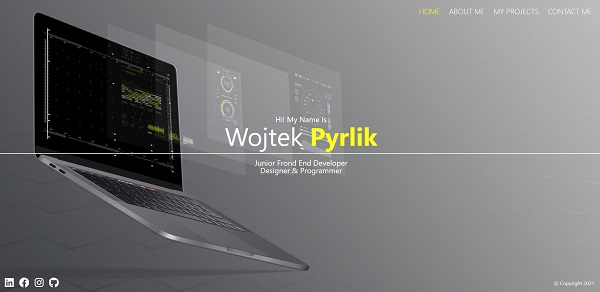
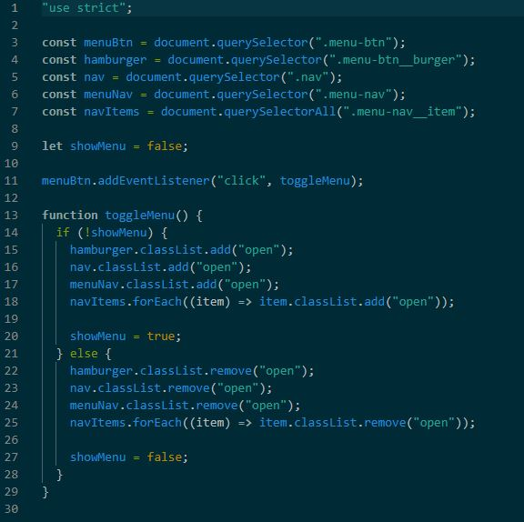

# Portfolio

https://wojti07.github.io/

## Table of contents

- [General info](#general-info)
- [Screenshots](#screenshots)
- [Technologies](#technologies)
- [Contact](#contact)

## General info

Responsive portfolio page about me. It consists of several pages, uses a CSS preprocessor,
also contains a small JavaScript code. Maybe you can read some information about me privately
and about my professional experience. You can also find some projects made by me.e.

## Screenshots

## Technologies

- HTML 5
- CSS 3
- JavaScript
- Sass
- RWD

## Code Examples

## Contact

Created by me - feel free to contact me!
